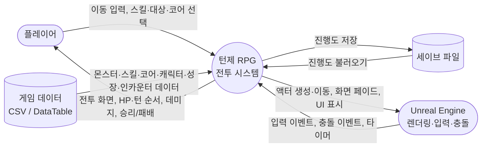
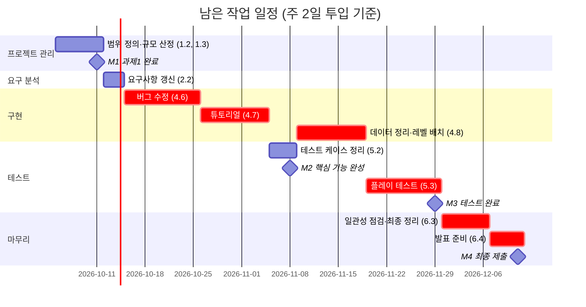

# 과제1: 프로젝트 관리 — 범위 정의 및 대상 시스템 분석

- 과목: 소프트웨어공학 (영남대학교)
- 프로젝트: Unreal Engine 5 기반 턴제 RPG 전투 시스템
- 작성자: 조의현
- 작성일: 2026-10-06

---

## 1단계. 대상 시스템 선택

### 1.1 대상 시스템

| 항목 | 내용 |
|---|---|
| 시스템명 | 턴제 RPG 전투 시스템 (프로토타입) |
| 형태 | PC용 3D 게임 (Unreal Engine 5.8, C++) |
| 개요 | 필드를 탐험하다 몬스터와 접촉하면 전용 전투 공간(아레나)으로 전환되어 턴제 전투가 시작되고, 전투 중 "코어"를 교체해 캐릭터의 스탯과 사용 스킬을 바꿔가며 싸우는 턴제 RPG |

### 1.2 시스템이 제어하는 대상

| 제어 대상 | 내용 |
|---|---|
| 전투 흐름 | 턴 순서 계산(SPD 기준), 전투 상태 전이(대기 → 턴 계산 → 아군/적 턴 → 전투 종료) |
| 캐릭터 | 플레이어 입력에 따른 아군 행동, AI에 의한 몬스터 행동, 스탯·HP·SP·레벨 |
| 화면 전환 | 필드 ↔ 전투 아레나 간 순간이동 및 화면 페이드 |
| 게임 데이터 | 몬스터·스킬·코어·캐릭터·성장치 데이터 조회, 진행도 저장 |

### 1.3 선택 이유

- 객체지향 설계(상속, 컴포넌트, 이벤트 기반 통신)를 적용하기 좋은 구조를 가진다.
- 기획 데이터를 코드와 분리하는 **데이터 주도 설계**(CSV → DataTable → 데이터 관리 서브시스템)를 연습할 수 있다.
- 기능 단위(전투, AI, UI, 데이터)가 명확히 나뉘어 SW 개발 수명주기 단계별 문서화에 적합하다.
- 수업 권장 규모(Class 약 30개)에 맞는 크기로 범위를 조절할 수 있다.

---

## 2단계. 프로젝트 범위 정의 (Project Scope Statement)

### 2.1 프로젝트 목표 (Objectives)

1. 튜토리얼 → 스테이지1 → 보스전 → 클리어까지 **한 번에 끝까지 플레이 가능한 프로토타입**을 완성한다.
2. 필드에서 전투로 **레벨 전환 없이** 자연스럽게 넘어가는 턴제 전투를 구현한다.
3. 모든 기획 데이터를 CSV로 관리하여 **코드 수정 없이 밸런스를 조정**할 수 있게 한다.
4. 요구분석부터 테스트까지 **SW 개발 수명주기 단계별 산출 문서**를 작성하고, 코드와 문서의 일관성을 유지한다.

### 2.2 범위 포함 사항 (In-Scope)

| 구분 | 내용 |
|---|---|
| 필드 ↔ 전투 전환 | 몬스터 접촉 시 화면 페이드 후 아레나로 이동, 전투 종료 후 원래 위치로 복귀 |
| 턴제 전투 | SPD 기반 턴 순서, 스킬·대상 선택, 데미지·회피·약점/내성·크리티컬 계산 |
| 파티 | 주인공 + 동료 1명 (2인 파티) |
| 코어 교체 | 코어 2종(검사 / 화염술사) 간 교체, 턴당 1회, 교체 시 스탯·스킬·약점/내성 변경 |
| 몬스터 AI | 가장 많은 피해를 준 대상 우선 공격, 대상의 약점 속성 스킬 우선 사용 |
| 성장 | 전투 승리 시 EXP 획득, 레벨업 시 데이터 기반 스탯 상승 |
| 튜토리얼 | 조작 안내가 포함된 전투 1회, 클리어 시 두 번째 코어 해금 |
| 스테이지 | 스테이지 1개 (잡몹 전투 3회 + 보스전) |
| 저장 | 진행도(튜토리얼·스테이지 클리어, 장착 코어) 저장 |
| 전투 UI | 커맨드 메뉴(스킬·대상·코어), 턴 순서 표시, 아군/적 HP 표시, 데미지 팝업, 승리/패배 표시 |
| 데이터 관리 | CSV 8종(몬스터, 플레이어 스킬, 몬스터 스킬, 코어, 캐릭터, 성장치, 필요 경험치, 인카운터) |

### 2.3 범위 제외 사항 (Out-of-Scope, 추후 확장)

| 항목 | 제외 사유 |
|---|---|
| 스테이지 2·3, 추가 동료·코어 | 1인 개발 일정상 핵심 루프 1회 완성에 집중 |
| 상태이상, 아이템, 회복 구역 | 설계 규칙은 정리되어 있으나 구현량이 커서 확장 단계로 미룸 |
| 방어·도주 커맨드, 보스 전용 기술 조건 | 전투 핵심 루프에 필수는 아님 |
| 게임오버 화면(재시작/타이틀), 타이틀·설정 화면 | 승리/패배 표시로 대체 |
| 그래픽 에셋·애니메이션·사운드 | 시스템 검증 우선(그레이박싱) 방침 |

---

## 3단계. 시스템 문맥도 및 이해관계자 분석

### 3.1 시스템 문맥도 (Context Diagram)

| 외부 개체 | 시스템으로 들어오는 것 | 시스템에서 나가는 것 |
|---|---|---|
| 플레이어 | 이동 입력, 스킬·대상·코어 선택 | 전투 화면, 상태 정보, 결과 |
| 게임 데이터 (CSV/DataTable) | 기획 데이터 일체 | – (읽기 전용) |
| 세이브 파일 | 저장된 진행도 | 갱신된 진행도 |
| Unreal Engine | 입력·충돌·타이머 이벤트 | 액터 생성/이동, 카메라 페이드, UI 출력 |

### 3.2 이해관계자 분석 (사용자 측면)

| 이해관계자 | 역할 | 요구·기대 | 관련 기능 |
|---|---|---|---|
| 플레이어 | 게임을 직접 플레이 | 조작이 쉽고, 약점 공략·코어 교체로 전략적 선택이 가능한 전투 | 커맨드 메뉴, 튜토리얼, 코어 교체, 데미지 표시 |
| 기획자 (본인 겸임) | 몬스터·스킬·밸런스 데이터 작성 | 코드를 고치지 않고 엑셀만 수정해 밸런스 조정 | CSV → DataTable 데이터 주도 구조 |
| 개발자 (본인) | 설계·구현·테스트 | 기능 추가가 쉬운 구조, 문서와 코드의 일치 | 공통 베이스 클래스, 컴포넌트 구조, 이벤트 기반 UI |
| 평가자 (담당 교수) | 산출물 평가 | 단계별 문서의 완성도, 문서 간·문서와 코드 간 일관성 | 전체 산출 문서, GitHub 저장소 |

---

## 4단계. 제약사항

| 구분 | 제약사항 |
|---|---|
| 인력 | 1인 개발 (기획·설계·구현·테스트·문서 전부 담당) |
| 기간 | 1학기 내 완료, 단계별 문서 제출 일정 준수 |
| 규모 | 수업 기준 Class 약 30개 내외 |
| 개발 환경 | Unreal Engine 5.8, C++, Visual Studio 2022, Windows PC |
| 코딩 규칙 | 언리얼 표준 준수: `std` 컨테이너 및 `using namespace std` 미사용, 언리얼 내장 컨테이너 사용 / 엔진 내장 함수와 이름 중복 금지(예: `TakeRPGDamage`) |
| 설계 원칙 | 기획 수치 하드코딩 금지 — 데이터는 CSV → DataTable → `URPGDataManager` 경로로만 주입 |
| 성능 | 턴제 특성상 불필요한 Tick 비활성화, 레벨 로딩 없이 동일 레벨 내 전투 전환 |
| 법적 (라이선스) | 외부 에셋은 무료·공개 라이선스만 사용하고 출처 표기 (Unreal Fab, Mixamo, game-icons.net 등) |
| 형상 관리 | Git + GitHub로 버전 관리, 언리얼 빌드 산출물(Binaries, Intermediate 등) 제외 |

---

## 5단계. 프로젝트 규모 산정

프로토타입 일부가 이미 구현되어 있으므로, **현재 코드 실측값을 기준으로 남은 작업을 더한 LOC를 추정**하고 이를 COCOMO와 기능점수(FP)로 산정한다.

### 5.1 LOC 추정 (상향식, 3점 추정)

- 현재 실측: RPG 관련 소스 36개 파일, 공백·주석 제외 **2,476 LOC** (언리얼 템플릿 코드 제외)
- 남은 작업(튜토리얼, 동료 턴 처리, 버그 수정 등)을 반영한 최종 규모 추정

| 낙관치 | 중간치 | 비관치 | 추정치 = (낙관 + 4×중간 + 비관) / 6 |
|---|---|---|---|
| 2,600 | 2,800 | 3,200 | **약 2,833 LOC (2.83 KLOC)** |

### 5.2 COCOMO (단순형, Organic)

규모가 50 KDSI 이하이고 복잡도가 높지 않은 1인 응용 프로그램이므로 단순형으로 분류한다.

- 노력: PM = 2.4 × (2.83)^1.05 ≈ **7.2 MM(인월)**
- 기간: TDEV = 2.5 × (7.2)^0.38 ≈ **5.3개월**
- 평균 투입 인원: 7.2 / 5.3 ≈ 1.4명

> 산정된 노력(7.2 MM)은 1인·1학기 투입량보다 다소 크다. 그러나 전체 추정 규모 2.83 KLOC 중 약 2.48 KLOC(약 87%)가 이미 프로토타입으로 구현되어 있어 남은 작업량은 이보다 훨씬 작다. 또한 원래 구상(스테이지 3개, 상태이상·아이템 등)까지 포함하면 규모가 크게 늘어나므로, 2.3과 같이 범위를 제외하여 일정 내 완료 가능하도록 조정하였다.

### 5.3 기능점수 (FP, 참고)

| 기능 유형 | 항목 | 개수 | 가중치 | 점수 |
|---|---|---|---|---|
| EIF (외부 연계 파일) | 엑셀에서 관리하고 시스템은 참조만 하는 데이터 테이블 8종 | 8 | 5.4 | 43.2 |
| ILF (내부 논리 파일) | 시스템이 생성·갱신하는 세이브 데이터 | 1 | 7.5 | 7.5 |
| EI (외부 입력) | 스킬 선택, 대상 선택(행동 확정), 코어 교체, 진행도 저장 | 4 | 4.0 | 16.0 |
| EO (외부 출력) | 데미지/회피 결과 표시, 전투 결과(EXP·레벨업), 턴 순서 표시, 아군/적 상태 표시 | 4 | 5.2 | 20.8 |
| EQ (외부 조회) | 스킬 목록, 대상 목록, 코어 목록 조회, 진행도 불러오기 | 4 | 3.9 | 15.6 |
| **합계 (UFP)** | | | | **103.1** |

- 보정 전 개발 원가: 103.1 × 605,784원(2024 FP 단가) ≈ 62,456,000원
- 규모 보정(500FP 미만 → 1.28)만 적용한 보정 후 원가: 약 **79,944,000원** (그 외 보정계수는 보통 1.0으로 가정)

---

## 6단계. 주요 업무 구분 및 WBS

### 6.1 개발 프로세스 모델

**진화적 프로토타입 모델**을 적용한다. 서드퍼슨 템플릿 위에서 전투가 동작하는지 먼저 프로토타입으로 확인했고, 이를 바탕으로 요구사항과 범위를 확정한 뒤 기능을 점진적으로 보완한다. 범위가 불명확해지기 쉬운 프로토타입 모델의 단점은 2단계의 In-Scope / Out-of-Scope 정의로 통제한다.

### 6.2 주요 업무 구분

| 업무 | 내용 | 산출물 |
|---|---|---|
| 1. 프로젝트 관리 | 범위 정의, 규모 산정, 일정 계획 | 과제1 문서 |
| 2. 요구 분석 | 기능·비기능 요구사항 정의 | 요구사항 정의서 |
| 3. 설계 | 클래스·시퀀스 설계, 데이터·인터페이스 명세 | 클래스 다이어그램 4종, 시퀀스 다이어그램 3종, 데이터 명세서, 인터페이스 명세서 |
| 4. 구현 | 데이터 계층, 엔티티, 전투, AI, UI, 필드 전환, 튜토리얼 | 소스 코드, CSV 데이터 |
| 5. 테스트 | 테스트 케이스 작성·수행 | 테스트 케이스 표 |
| 6. 유지보수·마무리 | 변경 이력 관리, 최종 정리, 발표 | 설계 변경 이력, GitHub 저장소, 발표 자료 |

### 6.3 WBS

| ID | 작업 | 기간(일) | 선행 작업 | 산출물 | 상태 |
|---|---|---|---|---|---|
| 1 | **프로젝트 관리** | | | | |
| 1.1 | 기획 구상 및 프로토타입 방향 설정 | 3 | – | 기획 메모 | 완료 |
| 1.2 | 범위 정의 · 문맥도 · 이해관계자 분석 | 3 | 1.1 | 과제1 문서 | 진행 중 |
| 1.3 | 규모 산정 · WBS 작성 | 2 | 1.2 | 과제1 문서 | 진행 중 |
| 2 | **요구 분석** | | | | |
| 2.1 | 기능·비기능 요구사항 정의 | 3 | 1.1 | 요구사항 정의서 | 완료 |
| 2.2 | 범위 축소에 맞춘 요구사항 갱신 | 1 | 1.2 | 요구사항 정의서 | 예정 |
| 3 | **설계** | | | | |
| 3.1 | 데이터 구조 설계 (CSV 8종, 구조체) | 2 | 2.1 | 데이터 명세서 | 완료 |
| 3.2 | 클래스 설계 (4개 영역) | 4 | 2.1 | 클래스 다이어그램 | 완료 (수정 중) |
| 3.3 | 시퀀스 설계 (필드→전투, 코어 교체, 보스전) | 3 | 3.2 | 시퀀스 다이어그램 | 완료 |
| 3.4 | 인터페이스 명세 | 2 | 3.2 | 인터페이스 명세서 | 완료 |
| 4 | **구현** | | | | |
| 4.1 | 데이터 계층 (DataManager, DataTable 임포트) | 3 | 3.1 | 소스, CSV | 완료 |
| 4.2 | 캐릭터·컴포넌트 (스탯, 스킬, 코어 교체, 성장) | 5 | 4.1 | 소스 | 완료 |
| 4.3 | 전투 제어 · 몬스터 AI · 데미지 계산 | 5 | 4.2 | 소스 | 완료 |
| 4.4 | 필드 ↔ 전투 전환 | 3 | 4.3 | 소스 | 완료 |
| 4.5 | 전투 UI | 4 | 4.3 | 소스, 위젯 | 완료 |
| 4.6 | 버그 수정 (STR/MAG 분기, 확률 단위, 동료 턴, 코어 약점/내성) | 3 | 4.3 | 소스 | 예정 |
| 4.7 | 튜토리얼 (해금 처리, 안내 텍스트) | 3 | 4.6 | 소스, 데이터 | 예정 |
| 4.8 | 데이터 정리 및 레벨 배치 (튜토리얼, 스테이지1, 보스방) | 3 | 4.7 | 레벨, CSV | 예정 |
| 5 | **테스트** | | | | |
| 5.1 | 테스트 케이스 작성 | 2 | 3.4 | 테스트 케이스 표 | 완료 |
| 5.2 | 범위에 맞춘 테스트 케이스 정리 · 추가 | 1 | 4.7 | 테스트 케이스 표 | 예정 |
| 5.3 | 플레이 테스트 수행 · 결과 기록 | 3 | 4.8 | 테스트 결과 | 예정 |
| 6 | **유지보수 · 마무리** | | | | |
| 6.1 | 형상 관리 환경 구축 (Git, GitHub) | 1 | – | 저장소 | 완료 |
| 6.2 | 설계 변경 이력 관리 | 지속 | – | 설계 변경 이력 | 진행 중 |
| 6.3 | 문서 간 일관성 점검 · 최종 정리 | 2 | 5.3 | 전체 문서 | 예정 |
| 6.4 | 발표 준비 | 2 | 6.3 | 발표 자료 | 예정 |

### 6.4 일정 계획 및 규모 산정과의 연계

#### (1) 단계별 노력 합계 (개발 단계별 노력 기법)

WBS의 작업 기간을 업무별로 합산하면 다음과 같다. (WBS 6.2 설계 변경 이력 관리는 상시 작업이므로 제외)

| 업무 | 기간(일) | 비율 | 완료 | 진행 중 | 예정 |
|---|---|---|---|---|---|
| 1. 프로젝트 관리 | 8 | 13% | 3 | 5 | 0 |
| 2. 요구 분석 | 4 | 6% | 3 | 0 | 1 |
| 3. 설계 | 11 | 17% | 11 | 0 | 0 |
| 4. 구현 | 29 | 46% | 20 | 0 | 9 |
| 5. 테스트 | 6 | 10% | 2 | 0 | 4 |
| 6. 유지보수·마무리 | 5 | 8% | 1 | 0 | 4 |
| **합계** | **63** | 100% | **40** | **5** | **18** |

- 전체 63 작업일 중 40일(약 63%)이 완료되었고, 남은 작업은 23일이다.
- 코드 기준 진척도(2,476 / 2,833 LOC ≈ 87%)보다 일정 기준 진척도가 낮은 이유는, 남은 작업이 코드 작성보다 테스트·문서 정리·레벨 배치 비중이 크기 때문이다. 이는 LOC 기법이 구현 단계만 반영한다는 한계를 단계별 노력 기법이 보완함을 보여준다.

#### (2) COCOMO 산정 결과와의 비교

1 MM을 20 작업일로 가정하면 WBS 합계 63일은 약 3.2 MM으로, COCOMO 산정값(7.2 MM)의 약 44% 수준이다. 차이의 원인은 다음과 같이 판단한다.

- COCOMO는 과거 산업 프로젝트의 평균 생산성을 기반으로 하므로, 엔진(Unreal Engine)이 렌더링·입력·충돌 등을 제공하는 본 프로젝트의 생산성을 반영하지 못한다.
- 본 프로젝트는 그래픽·사운드를 제외한 그레이박싱 프로토타입으로, 상용 수준의 품질 보증·운영 문서가 범위에 포함되지 않는다.

따라서 COCOMO 결과는 **범위 확대 시의 상한 기준**으로, WBS 합계는 **실제 일정 계획의 기준**으로 사용한다. 실제 진행 중 지연이 발생하면 Out-of-Scope 항목을 재검토하지 않고, 6.4 (3)의 기준에 따라 In-Scope 내 우선순위를 조정한다.

단, 실제 투입은 주 2일(약 0.4명 분량)이므로, 노력(63 인일)은 같아도 달력상 기간은 전일 투입 대비 약 2.5배로 늘어난다.

#### (3) 남은 작업 일정 (Gantt Chart)

수업 병행으로 실제 작업은 주 2일을 기준으로 한다. 1인 개발이므로 작업을 병렬로 수행할 수 없어, 선행 관계를 지키면서 남은 18 작업일(1.2·1.3 제외)을 주 2일씩 순차 배치하였다.

| 주차 | 기간 | 작업 (작업일) | 마일스톤 |
|---|---|---|---|
| W1 | 10/5~10/11 | 범위 정의·규모 산정·WBS 마무리 (1.2, 1.3) | M1 과제1 완료 (베이스라인 설정) |
| W2 | 10/12~10/18 | 요구사항 갱신 (2.2, 1일), 버그 수정 (4.6, 1일) | |
| W3 | 10/19~10/25 | 버그 수정 (4.6, 2일) | |
| W4 | 10/26~11/1 | 튜토리얼 (4.7, 2일) | |
| W5 | 11/2~11/8 | 튜토리얼 (4.7, 1일), 테스트 케이스 정리 (5.2, 1일) | M2 핵심 기능 완성 · 진척 점검 |
| W6 | 11/9~11/15 | 데이터 정리·레벨 배치 (4.8, 2일) | |
| W7 | 11/16~11/22 | 데이터 정리·레벨 배치 (4.8, 1일), 플레이 테스트 (5.3, 1일) | |
| W8 | 11/23~11/29 | 플레이 테스트 (5.3, 2일) | M3 테스트 완료 |
| W9 | 11/30~12/6 | 일관성 점검·최종 정리 (6.3, 2일) | |
| W10 | 12/7~12/11 | 발표 준비 (6.4, 2일) | M4 최종 제출 |

주 2일 기준으로도 일정 여유(buffer)가 없으므로, M2 시점(W5)에 진척을 점검하여 1주 이상 지연된 경우 아래 순서로 범위를 조정한다.

1. 스테이지1 잡몹 전투를 3회에서 2회로 축소 (4.8 기간 단축)
2. 튜토리얼 안내를 전투 중 팝업에서 시작 전 안내 화면 1장으로 단순화 (4.7 기간 단축)
3. 위 조정 후에도 지연되면 Out-of-Scope 항목 추가 없이 테스트(5.3)와 문서 점검(6.3) 기간은 유지하고 구현 범위를 우선 축소한다.

### 6.5 위험 요소

| 위험 | 영향 | 발생 가능성 | 대응 |
|---|---|---|---|
| 1인 개발로 인한 일정 지연 | 상 | 중 | 범위를 최소 루프로 축소, 확장 기능은 Out-of-Scope로 분리 |
| 기능 추가로 인한 범위 확대 (Scope creep) | 중 | 상 | In-Scope 외 기능은 확장 메모로만 기록하고 구현하지 않음 |
| 코드 변경 후 문서 불일치 | 중 | 중 | 코드 수정과 문서 수정을 같은 커밋으로 관리, 제출 전 일관성 점검 |
| 언리얼 엔진 빌드·설정 문제 | 중 | 중 | 구조 변경 시 Live Coding 대신 전체 재빌드, Git으로 이전 상태 복구 |
| 수업 병행으로 인한 투입 시간 부족 (주 2일 미만) | 상 | 중 | M2(W5)에서 진척 점검, 지연 시 6.4 (3)의 순서로 구현 범위 축소 |
